<h2>TensorFlow-FlexUNet-Image-Segmentation-Hypertrophic-Obstructive-Cardiomyopathy (Updated: 2025/12/17)</h2>
<li>
2025/12/17: Updated color-class-mapping table in README.md.
</li>
 
Toshiyuki Arai 
Software Laboratory antillia.com 
 
This is the first experiment of Image Segmentation for <b>Hypertrophic Obstructive Cardiomyopathy (HOCM) valves</b> based on 
our <a href="./src/TensorFlowFlexUNet.py">TensorFlowFlexUNet</a>
 (<b>TensorFlow Flexible UNet Image Segmentation Model for Multiclass</b>)
, and a 512x512 pixels PNG 
<a href="https://drive.google.com/file/d/1gydyzfM3_qamI1PSZegf2cC5U5QZmGni/view?usp=sharing">
<b>HOCMvalves-ImageMask-Dataset.zip</b></a>
which was derived by us from   
<a href="https://www.kaggle.com/datasets/xiaoweixumedicalai/hocmvalvesseg"> 
<b>HOCMvalvesSeg</b> 
</a> 
<b>Segmentation-of-Aortic-and-Mitral-Valves-for-Heart-Surgical-Planning-of-HOCM
</b>
 

<b>Actual Image Segmentation for HOCMvalves Images of 512x512 pixels</b> 
As shown below, the inferred masks predicted by our segmentation model trained on our dataset appear similar to the ground 
truth masks. 
<b><a href="#color-class-mapping-table">Color-class-mapping-table</a></b> 
 
<table>
<tr>
<th>Input: image</th>
<th>Mask (ground_truth)</th>
<th>Prediction: inferred_mask</th>
</tr>
<tr>
<td>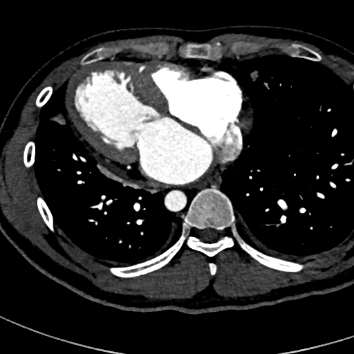</td>
<td></td>
<td>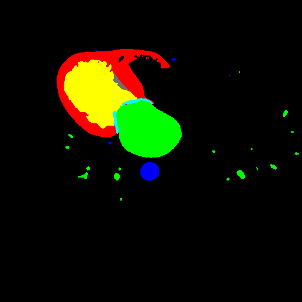</td>
</tr>
</tr>
<td>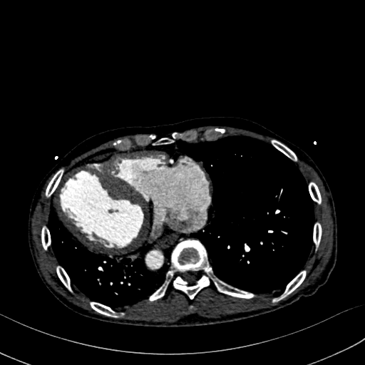</td>
<td>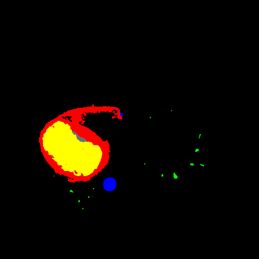</td>
<td>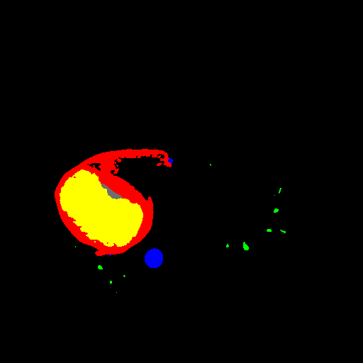</td>
</tr>
<tr>
<td>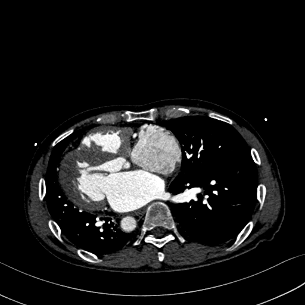</td>
<td>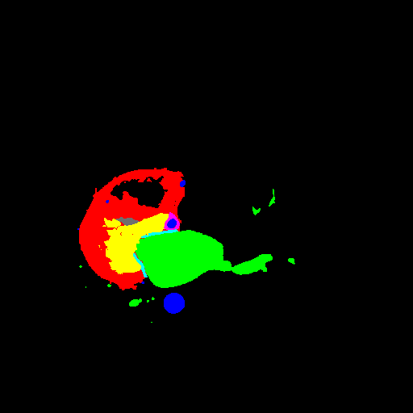</td>
<td>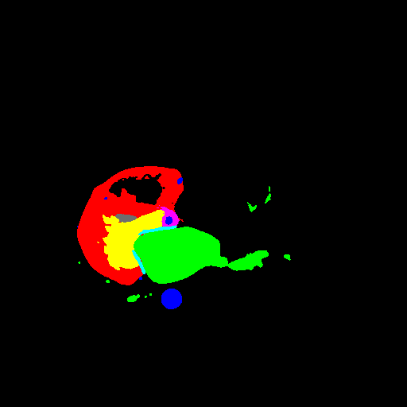</td>
</tr>
</table>

 
<h3>
1 Dataset Citation
</h3>
The dataset used here was derived from   
<a href="https://www.kaggle.com/datasets/xiaoweixumedicalai/hocmvalvesseg"> 
<b>HOCMvalvesSeg</b>
</a> 
 
<b>Segmentation-of-Aortic-and-Mitral-Valves-for-Heart-Surgical-Planning-of-HOCM
</b>
 
 
<b>About Dataset</b> 
Hypertrophic obstructive cardiomyopathy (HOCM) is a leading cause of sudden cardiac death in young people. Septal myectomy surgery has been recognized as the gold standard for non-pharmacological therapy of HOCM, in which aortic and mitral valves are critical regions for surgical planning. Currently, manual segmentation of aortic and mitral valves is widely performed in clinical practice to construct 3D models used for HOCM surgical planning. 
Such a process, however, is time-consuming and costly.
 
Our dataset consists of 27 3D CT images captured by a Siemens SOMATOM Definition Flash machine. 
The ages of the associated patients range from 38 to 76 years with an average of 57.6 years.  
The size of the images is 512 × 512×(275−571), and the typical voxel size is 0.25×0.25×0.5mm3.  
The annotations were performed by two experienced radiologists, and the time for labeling each image is 0.5-1.5 hours. 
 The labels include seven substructures:  
 AV, MV, AO, LA, LV, myocardium, and excised myocardium. 

The first task includes in total 1200 coronary vessel tree images, which are divided into train(1000) 
and validation(200) groups, images for training are followed with annotations, 
depicting the division of a heart into 26 different regions based on the Syntax Score methodology[1]. 

 Similarly, the second task includes a different set of 1200 images with same train-val division proportion 
 with annotated regions containing atherosclerotic plaques.  
  This dataset, carefully annotated by medical experts, enables scientists to actively contribute 
 towards the advancement of an automated risk assessment system for patients with CAD. 
  
This related paper is at 
<a href="https://proceedings.mlr.press/v222/zheng24a/zheng24a.pdf">
https://proceedings.mlr.press/v222/zheng24a/zheng24a.pdf
</a>.
 
 
<b>License</b> 
<a href="https://www.apache.org/licenses/LICENSE-2.0">
Apache 2.0
</a>
  
<h3>
2 HOCMvalves ImageMask Dataset
</h3>
<h4>2.1 Download PNG ImageMask Dagtaset</h4>
 If you would like to train this HOCMvalves Segmentation model by yourself,
 please download <a href="https://drive.google.com/file/d/1gydyzfM3_qamI1PSZegf2cC5U5QZmGni/view?usp=sharing">
 <b>HOCMvalves-ImageMask-Dataset.zip</b></a>
on the google drive, expand the downloaded, and put it under dataset folder to be:
<pre>
./dataset
└─HOCMvalves
    ├─test
    │  ├─images
    │  └─masks
    ├─train
    │  ├─images
    │  └─masks
    └─valid
        ├─images
        └─masks
</pre>
<b>HOCMvalves Statistics</b> 
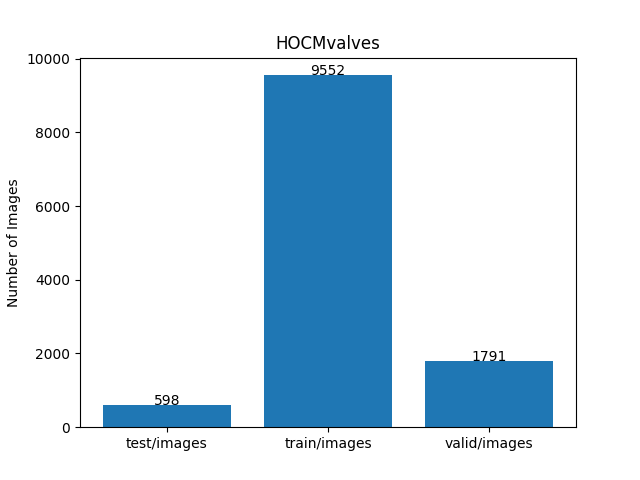 
 
As shown above, the number of images of train and valid datasets is large enough to use for a training set of our segmentation model.
  
<h4>2.2 PNG ImageMask Dataset Derivation</h4>
The folder structure of 
<a href="https://www.kaggle.com/datasets/xiaoweixumedicalai/hocmvalvesseg"> 
 HOCMvalvesSeg
 </a>
 is the following. 
<pre>
./HOCMvalvesSeg
  ├─3_image.nii
  ├─3_label.nii
...
  ├─48_image.nii
  └─48_label.nii
</pre>
We used the following 2 Python scripts to generate our PNG dataset from 27 image.nii and corresponding label.nii in
the dataset.
<ul>
<li><a href="./generator/ImageMaskDatasetGenerator.py">ImageMaskDatasetGenerator.py</a></li>
<li><a href="./generator/split_master.py">split_master.py</a></li>
</ul>
We aslo used the following color-class mapping table to generate our colorized masks, and define a rgb_map for our mask format between
indexed color and rgb colors in <a href="./projects/TensorFlowFlexUNet/HOCMvalves/train_eval_infer.config">train_eval_infer.config</a> 
 
<a id="color-class-mapping-table">Color-class-mapping-table</a></b>     
<table border=1 style='border-collapse:collapse;' cellpadding='5'>
<tr><th>Indexed Color</th><th>Color</th><th>RGB</th><th>Class</th></tr>
<tr><td>1</td><td with='80' height='auto'><td>(255, 0, 255)</td><td>AV</td></tr>
<tr><td>2</td><td with='80' height='auto'><td>(0, 255, 255)</td><td>MV</td></tr>
<tr><td>3</td><td with='80' height='auto'><td>(0, 0, 255)</td><td>AD</td></tr>
<tr><td>4</td><td with='80' height='auto'><td>(0, 255, 0)</td><td>LA</td></tr>
<tr><td>5</td><td with='80' height='auto'><td>(255, 255, 0)</td><td>LV</td></tr>
<tr><td>6</td><td with='80' height='auto'><td>(255, 0, 0)</td><td>Myocardium</td></tr>
<tr><td>7</td><td with='80' height='auto'><td>(110, 110, 110)</td><td>Excised-myocardium</td></tr>
</table>
 
 
<h4>2.3 ImageMask Dataset Sample</h4>
<b>Train_images_sample</b> 
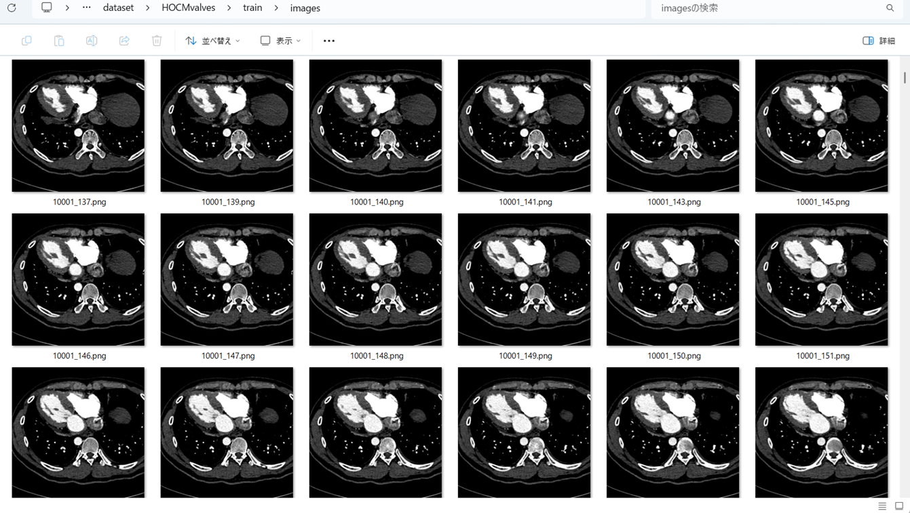
 
<b>Train_masks_sample</b> 
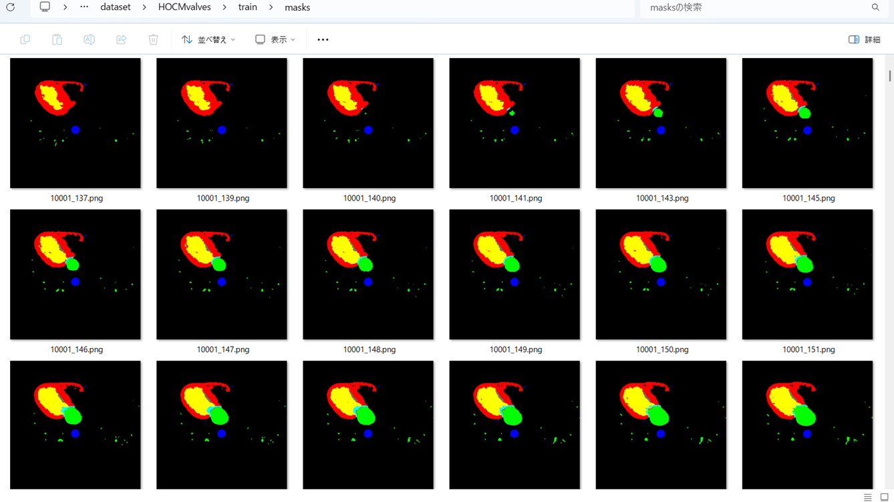
 
 
<h3>
3 Train TensorFlowFlexUNet Model
</h3>
 We trained HOCMvalves TensorFlowFlexUNet Model by using the following
<a href="./projects/TensorFlowFlexUNet/HOCMvalves/train_eval_infer.config"> <b>train_eval_infer.config</b></a> file.  
Please move to ./projects/TensorFlowFlexUNet/HOCMvalves, and run the following bat file. 
<pre>
>1.train.bat
</pre>
, which simply runs the following command. 
<pre>
>python ../../../src/TensorFlowFlexUNetTrainer.py ./train_eval_infer.config
</pre>

<b>Model parameters</b> 
Defined a small <b>base_filters = 16</b> and a large <b>base_kernels = (11,11)</b> for the first Conv Layer of Encoder Block of 
<a href="./src/TensorFlowFlexUNet.py">TensorFlowFlexUNet.py</a> 
and a large num_layers (including a bridge between Encoder and Decoder Blocks).
<pre>
[model]
image_width    = 512
image_height   = 512
image_channels = 3
input_normalize = True
num_classes    = 8

base_filters   = 16
base_kernels   = (11,11)
num_layers     = 8
dropout_rate   = 0.05
dilation       = (1,1)
</pre>

<b>Learning rate</b> 
Defined a very small learning rate.  
<pre>
[model]
learning_rate  = 0.00007
</pre>

<b>Online augmentation</b> 
Disabled our online augmentation.  
<pre>
[model]
model         = "TensorFlowFlexUNet"
generator     = False
</pre>

<b>Loss and metrics functions</b> 
Specified "categorical_crossentropy" and <a href="./src/dice_coef_multiclass.py">"dice_coef_multiclass"</a>. 
You may specify other loss and metrics function names. 
<pre>
[model]
loss           = "categorical_crossentropy"
metrics        = ["dice_coef_multiclass"]
</pre>
<b>Learning rate reducer callback</b> 
Enabled learing_rate_reducer callback, and a small reducer_patience.
<pre> 
[train]
learning_rate_reducer = True
reducer_factor     = 0.5
reducer_patience   = 4
</pre>

<b>Early stopping callback</b> 
Enabled early stopping callback with patience parameter.
<pre>
[train]
patience      = 10
</pre>

<b>RGB Color map</b> 
rgb color map dict for HOCMvalves 1+7 classes. 
<b><a href="#color-class-mapping-table">Color-class-mapping-table</a></b>     
<pre>
[mask]
mask_datatype    = "categorized"
mask_file_format = ".png"
; HOCMvalves 1+7 classes
rgb_map = {(0,0,0):0, (255,0,255):1,(0,255,255):2,(0,0,255):3,(0,255,0):4,(255,255,0):5, (255,0,0):6,(110,110,110):7 }

</pre>

<b>Epoch change inference callback</b> 
Enabled <a href="./src/EpochChangeInferencer.py">epoch_change_infer callback (EpochChangeInferencer.py)</a></b>. 
<pre>
[train]
epoch_change_infer       = True
epoch_change_infer_dir   =  "./epoch_change_infer"
num_infer_images         = 6
</pre>

By using this callback, on every epoch_change, the inference procedure can be called
 for 6 images in <b>mini_test</b> folder. This will help you confirm how the predicted mask changes 
 at each epoch during your training process.    

<b>Epoch_change_inference output at starting (epoch 1,2,3)</b> 
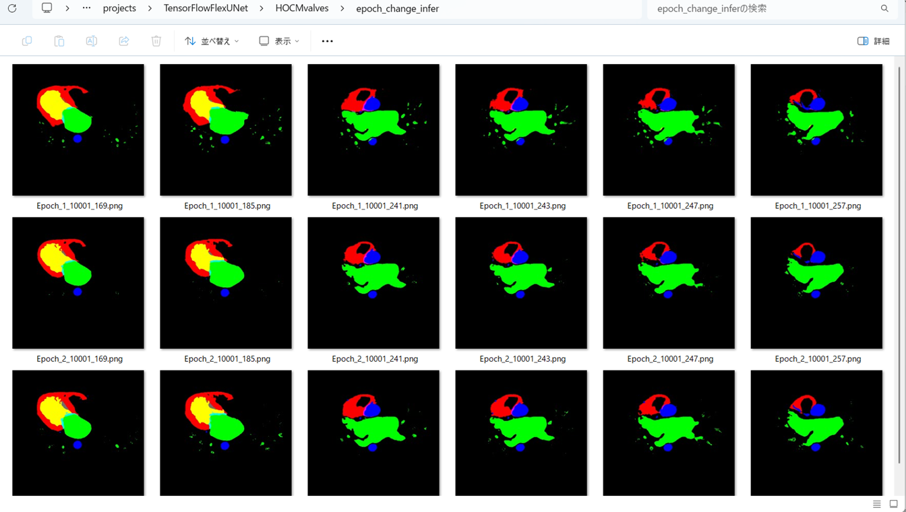 
 
<b>Epoch_change_inference output at middlepoint (epoch 13,14,15)</b> 
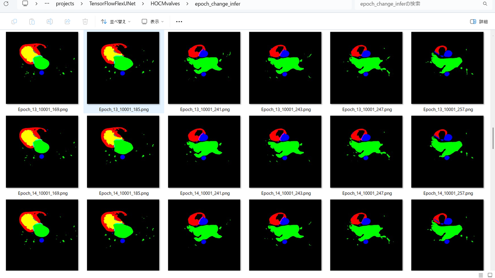 
 
<b>Epoch_change_inference output at ending (epoch 28,29,30)</b> 
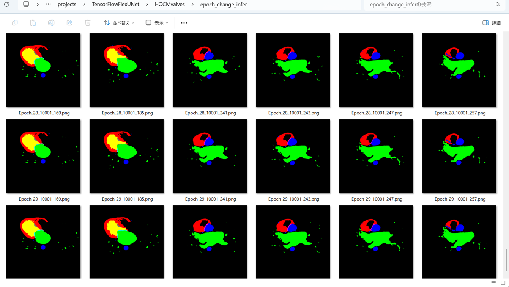 
 
In this experiment, the training process was terminated at epoch 30.  
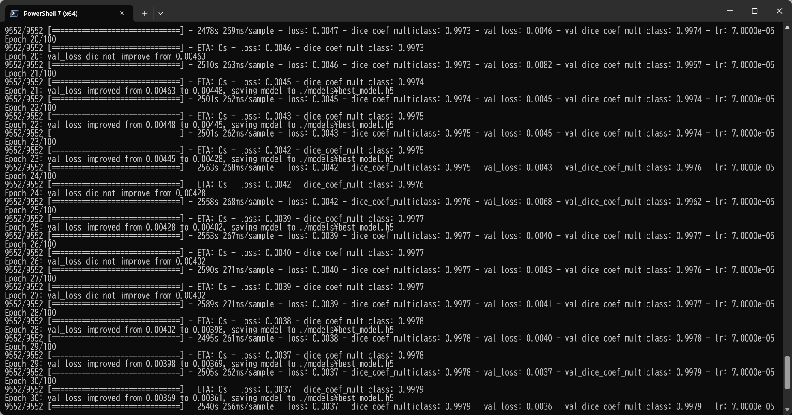 
 

<a href="./projects/TensorFlowFlexUNet/HOCMvalves/eval/train_metrics.csv">train_metrics.csv</a> 
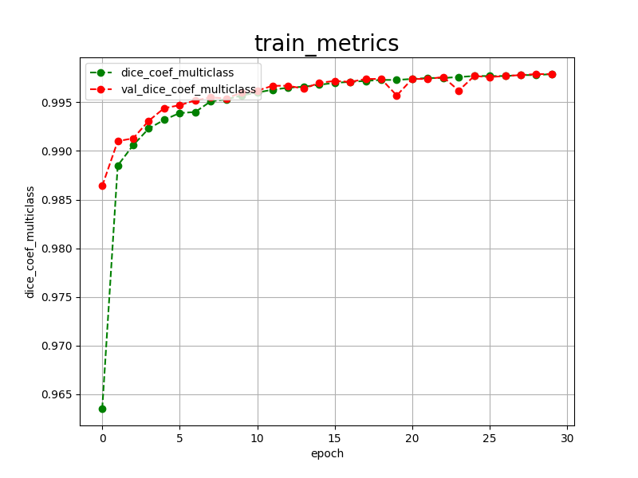 
 
<a href="./projects/TensorFlowFlexUNet/HOCMvalves/eval/train_losses.csv">train_losses.csv</a> 
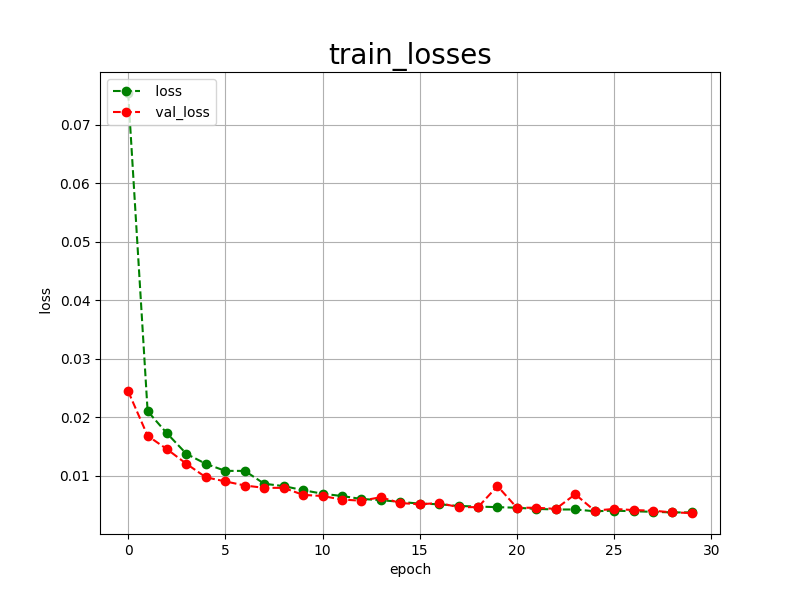 
 
<h3>
4 Evaluation
</h3>
Please move to a <b>./projects/TensorFlowFlexUNet/HOCMvalves</b> folder,
and run the following bat file to evaluate TensorFlowUNet model for HOCMvalves. 
<pre>
./2.evaluate.bat
</pre>
This bat file simply runs the following command.
<pre>
python ../../../src/TensorFlowFlexUNetEvaluator.py ./train_eval_infer.config
</pre>

Evaluation console output: 
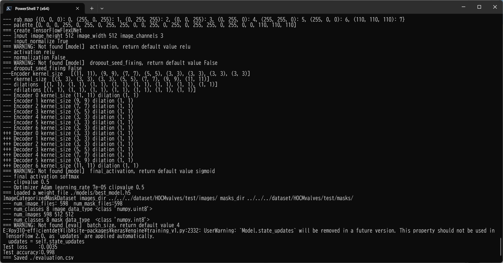
  Image-Segmentation-HOCMvalves

<a href="./projects/TensorFlowFlexUNet/HOCMvalves/evaluation.csv">evaluation.csv</a> 

The loss (categorical_crossentropy) to this HOCMvalves/test was very low, and dice_coef_multiclass very high as shown below.
 
<pre>
categorical_crossentropy,0.0035
dice_coef_multiclass,0.998
</pre>
 
<h3>
5 Inference
</h3>
Please move to a <b>./projects/TensorFlowFlexUNet/HOCMvalves</b> folder
, and run the following bat file to infer segmentation regions for images by the Trained-TensorFlowFlexUNet model for HOCMvalves. 
<pre>
./3.infer.bat
</pre>
This simply runs the following command.
<pre>
python ../../../src/TensorFlowFlexUNetInferencer.py ./train_eval_infer.config
</pre>

<b>mini_test_images</b> 
 
<b>mini_test_mask(ground_truth)</b> 
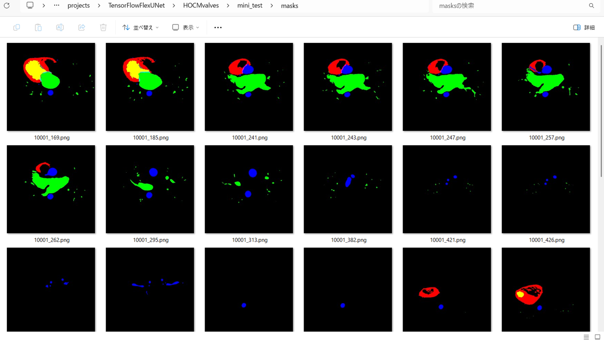 

<b>Inferred test masks</b> 
 
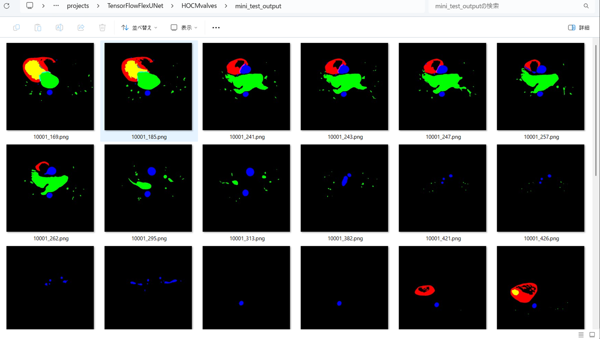 
 

<b>Enlarged images and masks for HOCMvalves Images of 512x512 pixels </b> 
<b><a href="#color-class-mapping-table">Color-class-mapping-table</a></b> 

<table>
<tr>
<th>Input: image</th>
<th>Mask (ground_truth)</th>
<th>Prediction: inferred_mask</th>
</tr>

<td>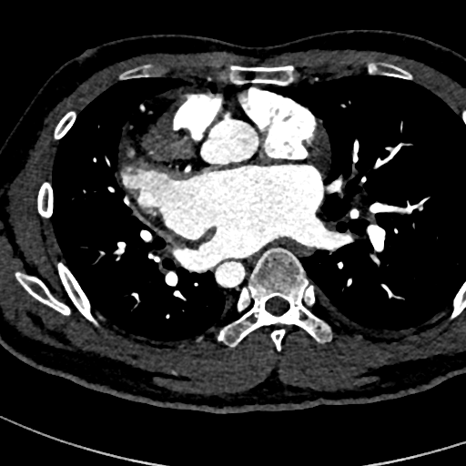</td>
<td>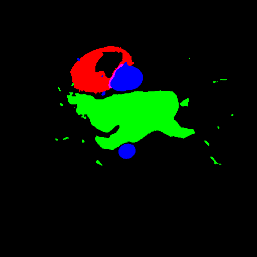</td>
<td></td>
</tr>
<tr>
<td>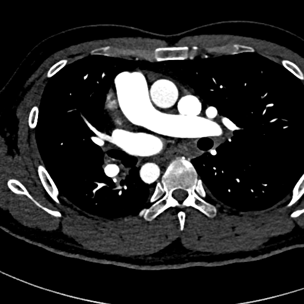</td>
<td>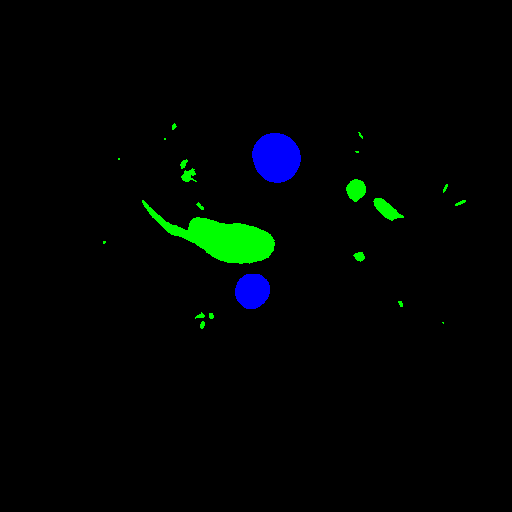</td>
<td></td>
</tr>
<tr>
<td>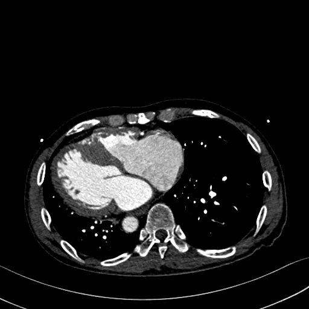</td>
<td></td>
<td>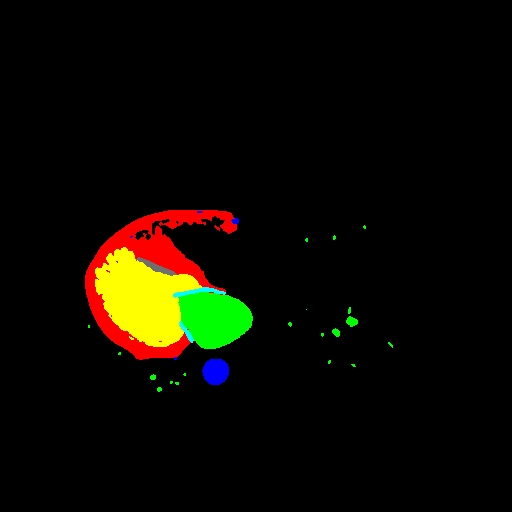</td>
</tr>
<tr>
<td>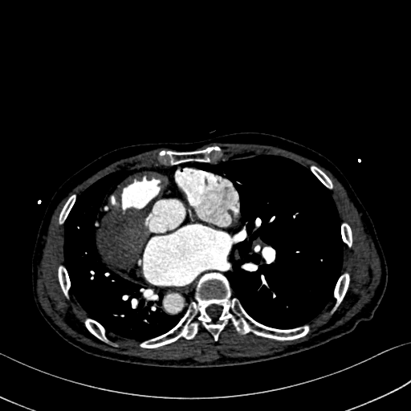</td>
<td></td>
<td>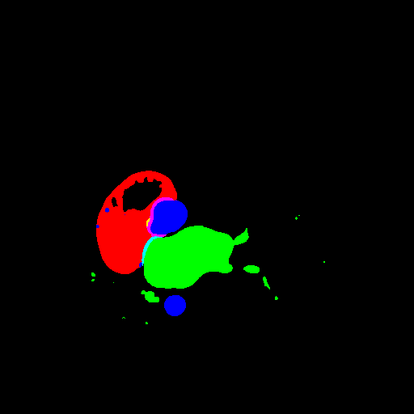</td>
</tr>
<tr>
<td>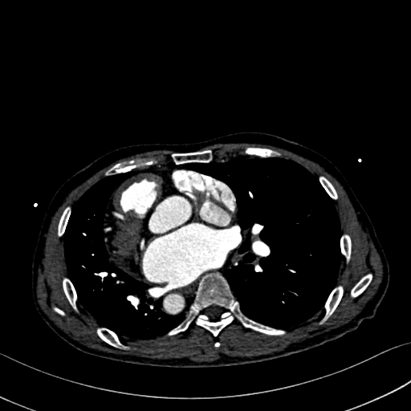</td>
<td></td>
<td>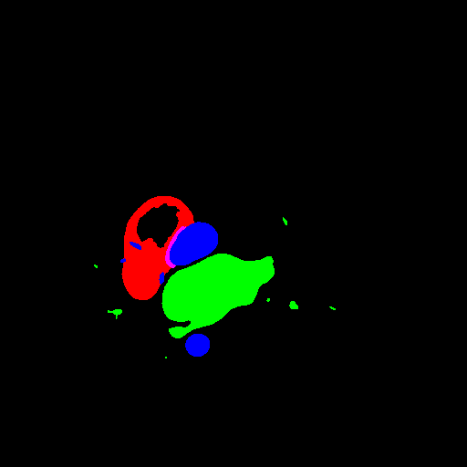</td>
</tr>
<tr>
<td>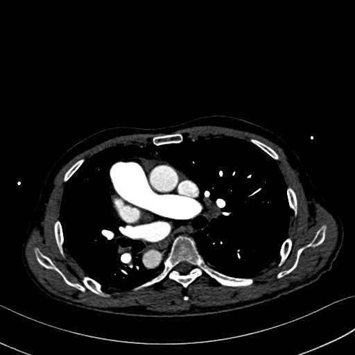</td>
<td>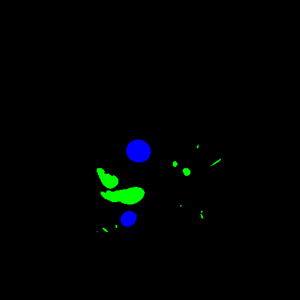</td>
<td>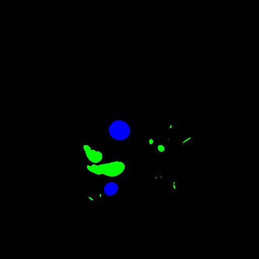</td>
</tr>
</table>

 
<h3>
References
</h3>
<b>1.Automatic Segmentation of Aortic and Mitral Valves for  
Heart Surgical Planning of Hypertrophic Obstructive Cardiomyopathy</b> 
Limin Zheng, Hongyu Chen, Bo Meng, Qing Lu, Jian Zhuang, Xiaowei Xu 
<a href="https://proceedings.mlr.press/v222/zheng24a/zheng24a.pdf">
https://proceedings.mlr.press/v222/zheng24a/zheng24a.pdf
</a>
 
 
<b>2.HOCM-Net: 3D Coarse-to-Fine Structural Prior Fusion based Segmentation Network for 
 the Surgical Planning of Hypertrophic Obstructive Cardiomyopathy</b> 
JerRuy  
<a href="https://github.com/JerRuy/HOCM-Net">https://github.com/JerRuy/HOCM-Net</a>
 
 
<b>3. TensorFlow-FlexUNet-Image-Segmentation-Coronary-Artery-Disease-ARCADE</b> 
Toshiyuki Arai antillia.com  
<a href="https://github.com/sarah-antillia/TensorFlow-FlexUNet-Image-Segmentation-Coronary-Artery-Disease-ARCADE">
TensorFlow-FlexUNet-Image-Segmentation-Coronary-Artery-Disease-ARCADE</a>.
 
 
<b>4. TensorFlow-FlexUNet-Image-Segmentation-Model</b> 
Toshiyuki Arai antillia.com  
<a href="https://github.com/sarah-antillia/TensorFlow-FlexUNet-Image-Segmentation-Model">
https://github.com/sarah-antillia/TensorFlow-FlexUNet-Image-Segmentation-Model
</a>
 
 
<!-
Image-Based Computational Hemodynamics Analysis of Systolic Obstruction in Hypertrophic Cardiomyopathy-

https://pmc.ncbi.nlm.nih.gov/articles/PMC8773089/
-->
